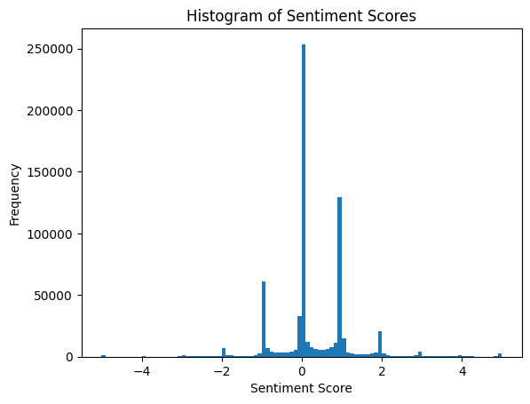

# News Sentiment Signal Research

## Goal
Financial news sentiment 기반 long 전략 검증

## Data
- [Financial news headline](https://huggingface.co/datasets/Zihan1004/FNSPID)
- CRSP daily price
- Period: 2010~2025

## Project Structure
```markdown
notes # experiment notes
src/
  backtest/ # backtesting
  data/ # download file
  feature/ # make feature
notebooks/

```

## Universe
- S&P500 constituents by date (historical membership)

## Method
- Sentiment: [mrm8488/deberta-v3-ft-financial-news-sentiment-analysis](https://huggingface.co/mrm8488/deberta-v3-ft-financial-news-sentiment-analysis)
- Aggregation: Daily Sum Score (to reflect news volume impact)
- Backtest: Score weight

### Signal Distribution


## Return Definition
- News published after market → next day open-to-close return
- News published before market → same day open-to-close return
- News published during market → next day open-to-close return

## Result

### Long Only (Daily Sum)
| Period | Sharpe | Turnover | Cost (per side) | MDD |
|--------|--------|---------|------|------|
| 2010~2023 | 1.35 | 2.0 | 13bp |37%|
| 2010–2020 | 1.75 | 2.0 | 13bp |37%|
| 2021–2023 | 0.01 | 2.0 | 13bp |26%|

### Equity Curve


## Issues
- 2021 이후 성과 급감
- Universe size 불안정
- Turnover 과다

## Future Work
- Get More New Data
- Regime filter
- Position smoothing

### Paper Reference
[Sentiment trading with large language models](https://arxiv.org/abs/2412.19245)

[Predicting Returns with Text Data](https://papers.ssrn.com/sol3/papers.cfm?abstract_id=3389884)